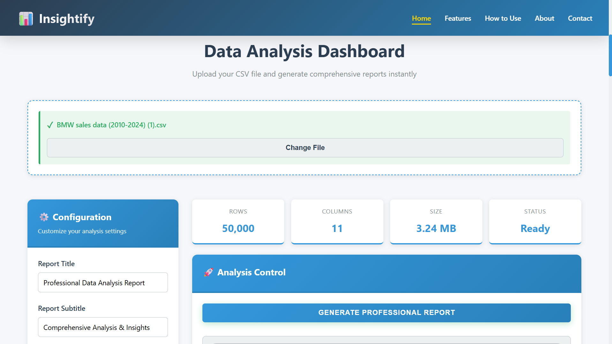

# 📊 Insightify - Professional Data Analysis & Report Generation  
**Task 3 – CODTECH Internship | Automated Report Generation**

---

### **COMPANY:** CODTECH IT SOLUTIONS  
### **NAME:** AMAN SHAIKH  
### **INTERN ID:** CT06DR1460  
### **DOMAIN:** Python Programming  
### **DURATION:** 6 Weeks  
### **MENTOR:** Neela Santhosh Kumar  

---

### 🚀 Live Preview

<p align="center">
  
</p>

---

A **professional-grade Data Analysis and Report Generation Web Application** built with **Python, Pandas, Matplotlib, and ReportLab**.

- Analyzes **ANY CSV file** with dynamic column detection
- Generates **professional PDF reports** with charts, statistics, and insights
- Features a **modern, responsive web interface** with real-time progress tracking
- Fully **mobile-responsive** with touch-friendly interactions
- Fulfills **Task 3 – Dynamic Report Generation & Data Visualization** (CODTECH Internship)

---

## ✨ Features

- **Universal CSV Support:** Automatically analyzes any CSV file structure
- **Dynamic Analysis Engine:** Detects numeric, categorical, and date columns
- **Professional PDF Reports:** Multi-page reports with executive summaries, statistics, and visualizations
- **Interactive Web Dashboard:** Modern UI with drag-and-drop file upload
- **Real-Time Progress Tracking:** Visual progress bar with status updates
- **Mobile Responsive:** Optimized for all devices (320px to 1024px+)
- **Download & Open Reports:** Direct PDF access from the browser
- **Recent Reports History:** Track and access previously generated reports

---

## 🛠️ Tech Stack

**Backend:**
- Python 3.x
- Pandas (Data Analysis)
- NumPy (Statistical Computations)
- Matplotlib & Seaborn (Visualizations)
- ReportLab (PDF Generation)

**Frontend:**
- HTML5 & CSS3
- Vanilla JavaScript
- Responsive Design (Mobile-First)

**Server:**
- Python HTTP Server
- Custom Multipart Form Parser

---

## 📁 Project Structure

```
Insightify/
├── frontend/
│   ├── index.html              # Main web interface
│   ├── styles.css              # Responsive styling
│   ├── app.js                  # Frontend logic
│   └── favicon.png             # Brand icon
├── backend/
│   ├── data_analyzer.py        # Dynamic CSV analysis
│   └── report_generator.py     # Professional PDF generation
├── data/                       # Uploaded CSV files
├── output/                     # Generated reports & charts
├── web_server.py               # Web server
├── generate_report.py          # CLI tool
├── requirements.txt            # Python dependencies
└── README.md                   # Documentation
```

---

## ⚙️ Setup Instructions

Follow these steps to set up and run Insightify locally:

### 1. **Clone the repository**
```bash
git clone https://github.com/yourusername/insightify.git
cd insightify
```

### 2. **Install dependencies**
It's recommended to use a virtual environment:
```bash
python -m venv venv
source venv/bin/activate  # On Windows: venv\Scripts\activate
pip install -r requirements.txt
```

Or, install packages directly:
```bash
pip install pandas numpy matplotlib seaborn reportlab
```

### 3. **Run the web application**
```bash
python web_server.py
```

### 4. **Open in browser**
Navigate to: [http://localhost:8000](http://localhost:8000)

### 5. **Generate a report**
- Upload any CSV file (drag & drop or click to browse)
- Configure report title and subtitle (optional)
- Click "Generate Professional Report"
- Wait for analysis to complete
- Download or open your PDF report!

---

## 📊 Report Contents

Each generated report includes:

1. **Title Page** - Professional branding with Insightify logo
2. **Executive Summary** - Dataset overview and composition
3. **Numeric Analysis** - Statistics for all numeric columns (mean, median, min, max)
4. **Categorical Analysis** - Top values and distributions for categorical data
5. **Correlation Analysis** - Relationships between variables
6. **Visualizations** - Charts and graphs (histograms, bar charts, heatmaps)
7. **Conclusions** - Automated insights and recommendations

---

## 💻 CLI Usage

Generate reports from the command line:

```bash
python generate_report.py data/your_file.csv -o output/report.pdf -c output/charts
```

**Options:**
- `-o, --output` - Output PDF file path
- `-c, --charts` - Charts directory path
- `-t, --title` - Report title
- `-s, --subtitle` - Report subtitle

---

## 📱 Mobile Support

Insightify is fully responsive and optimized for:

- ✅ iPhone (all models)
- ✅ Android phones
- ✅ iPad & tablets
- ✅ Desktop browsers
- ✅ Landscape & portrait orientations

**Breakpoints:**
- 1024px - Tablets
- 768px - Mobile landscape
- 480px - Mobile portrait
- 375px - Small devices

---

## 🎯 Key Features

### **Dynamic Analysis**
- Automatically identifies column types
- Generates appropriate statistics
- Creates relevant visualizations
- No hardcoded column names

### **Professional Reports**
- 15-20 page PDF documents
- Executive summaries
- Statistical tables
- Embedded charts
- Actionable insights

### **Modern Web Interface**
- Clean, intuitive design
- Real-time progress tracking
- Drag-and-drop file upload
- Touch-friendly interactions
- Recent reports history

### **Performance**
- Handles large datasets (1M+ rows)
- Fast analysis and generation
- Efficient chart rendering
- Local processing (privacy-first)

---

## 🔒 Privacy & Security

- ✅ All data processing happens **locally**
- ✅ No data sent to external servers
- ✅ Files stored only on your machine
- ✅ Complete data privacy

---

## 🎓 Use Cases

- **Data Analysts:** Quick insights from CSV data
- **Business Professionals:** Professional reports for stakeholders
- **Researchers:** Document findings with charts
- **Students:** Learn data analysis techniques
- **Developers:** Integrate into workflows

---

## 🌟 What Makes It Professional

1. **Universal Compatibility** - Works with ANY CSV structure
2. **Beautiful Design** - Modern UI with smooth animations
3. **Comprehensive Analysis** - Statistical rigor meets business insights
4. **Production Ready** - Error handling, logging, validation
5. **User Friendly** - No technical knowledge required
6. **Fast** - Handles large datasets efficiently
7. **Secure** - All processing happens locally
8. **Mobile Responsive** - Works on all devices

---

## 📸 Screenshots

### Dashboard


### Report Generation


### PDF Report


---

## 🤝 Contributing

Contributions are welcome! Please feel free to submit a Pull Request.

---

## � License

This project is part of the CODTECH IT SOLUTIONS internship program.

---

## 👨‍💻 Developer

**Aman Shaikh**  
Intern ID: CT06DR1460  
Domain: Python Programming  
Company: CODTECH IT SOLUTIONS  

---

## 🙏 Acknowledgments

- **Mentor:** Neela Santhosh Kumar
- **Company:** CODTECH IT SOLUTIONS
- **Duration:** 6 Weeks
- **Task:** Dynamic Report Generation & Data Visualization

---

Enjoy transforming your CSV data into professional insights with Insightify!  
Feel free to contribute or suggest improvements.

---

**Made with ❤️ for professional data analysis**
